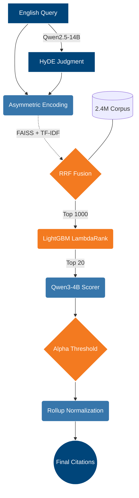

<p align="center">
  
</p>

# Swiss Legal Expert

<p align="left">
  
  
  
  
  
 
</p>

## 📌 Project Overview

An end-to-end, multi-stage information retrieval pipeline engineered to solve a complex cross-lingual matching problem within Swiss Law. This system maps layman English legal queries (e.g., "My employer fired me without notice because I was sick") to highly specific, formal Swiss legal citations (e.g., "Kündigung zur Unzeit nach Art. 336c OR") across a massive 2.4 million document corpus (comprising Federal Supreme Court considerations and hierarchical legislative statutes).

To bridge this massive semantic gap, the architecture leverages True HyDE (LLM-generated hypothetical judgments) alongside a 5-stream Asymmetric Vector Search (FAISS) to trap true positives. These candidates are aggressively filtered via a LightGBM LambdaRank model before a dynamic, Alpha-thresholded LLM extracts the final pointwise confidence scores, achieving a highly competitive exact-match Macro F1 of **0.337**.

---

## 🌪️ The Core Problem

Standard Retrieval-Augmented Generation (RAG) paradigms—such as directly projecting a query into a dense latent space and executing a k-NN search—suffer catastrophic failure modes in this domain due to four critical algorithmic bottlenecks:

1. **Orthogonal Latent Distributions (The Cross-Lingual Semantic Gap)**: The query distribution consists of highly informal, layman English narratives (e.g., "My ex-husband stopped paying child support"). In stark contrast, the target distribution is fundamentally multilingual, consisting of highly structured, formal Swiss-German, French, and Italian statutory law (e.g., "Unterhaltsbeiträge nach Art. 276 ZGB"). A standard English-centric embedding model cannot naturally align these wildly distinct linguistic and structural modalities into a shared latent subspace, resulting in severe vector collision and catastrophic recall drops.
2. **High-Dimensional Noise at Scale (2.4M Documents)**: The corpus merges ~2.4 million Federal Supreme Court considerations (judicial precedents like `BGE 139 I 2 E. 5.1`) with hundreds of thousands of legislative statutes (like `Art. 4 Abs. 1`). Executing dense similarity searches across this massive, dual-domain semantic space introduces overwhelming "distractor" noise. The high density of semantically adjacent but legally irrelevant documents easily saturates the Top-K retrieval window.
3. **Hierarchical Exact-Match Strictness**: Legal retrieval is evaluated under brutal strictness metrics. If the ground truth citation is `Art. 111 Abs. 2` and the model retrieves the broader parent `Art. 111`, the exact-match F1 score evaluates to **0.0**. Standard cosine similarity cannot inherently differentiate between fine-grained structural parent-child relationships in legal hierarchies.
4. **Uncalibrated Decision Boundaries (Variable Targets)**: Target citations per query are highly skewed, ranging from a single specific law to upwards of 40+ relevant precedents. A hardcoded, static retrieval threshold (e.g., "Top K=10") mathematically guarantees poor recall for complex queries and massive false-positive degradation for specific queries.

To overcome these constraints, I engineered a **7-Stage LambdaRank-LLM Pipeline** capable of funneling 2.4 million high-noise documents into a calibrated, perfectly curated exact-match citation list.

---

## 🚀 Core Engineering & Architecture

The system is designed to handle extreme semantic vocabulary gaps (e.g., mapping "my ex-husband stopped paying child support" to formal "Unterhaltsbeiträge nach Art. 276 ZGB"). It operates entirely offline without internet access or external APIs, processing queries efficiently under strict compute limitations.



### 1. Data Engineering & High-Performance Indexing
- **Combining Datasets**: Merged two very different legal datasets into one clean format:
  - **Laws (`laws_*.csv`)**: ~400k rows containing the law text and article numbers.
  - **Court Cases (`court_considerations.csv`)**: ~2 million rows containing judicial decisions and case IDs.
- **Beating RAM Limits (PyArrow)**: Converted the massive dataset into `.parquet` memory maps. This allowed the system to instantly fetch text directly from the hard drive without crashing Kaggle's limited RAM.
- **Fast Similarity Search (FAISS)**: Replaced slow Pandas operations with a highly optimized FAISS index. This enables lightning-fast, sub-second search across all 2.4 million documents.
- **Regex & Lexical Search (TF-IDF)**: Built regex parsers to clean up messy legal citations (e.g., mapping `Art. 111 Abs. 2` back to its parent `Art. 111`). Combined this with a TF-IDF sparse matrix to easily catch exact text matches (e.g., specific dates, exact locations, proper names).

### 2. Candidate Generation (Multi-Vector Fusion)
- **Hybrid Retrieval (Dense + Sparse)**: We execute a late-interaction fusion to solve the "exact-match vs. semantic-match" trade-off. By combining the dense semantic streams with exact lexical TF-IDF matrices via Reciprocal Rank Fusion (RRF), the pipeline establishes a strong +6.51% baseline recall improvement.
- **Distribution Alignment (HyDE)**: Standard query embeddings suffer from severe vocabulary gaps when mapped against formal legal texts. To bridge this, I deployed `Qwen2.5-14B-Instruct` to generate "perfect" hypothetical Swiss judgments (HyDE) before searching. This semantic alignment boosted our Top-1000 recall by +14.34%.
- **5-Stream Asymmetric Search**: A single query vector cannot capture both semantic intent and strict lexical needs. I engineered an architecture that encodes five distinct vector projections per query (Raw Query, HyDE Judgment, Explicit Keywords, Literal Text, and Regex Citations). Broadcasting these against the FAISS index drove total Recall@1000 to an impressive 51.83%.

### 3. Machine Learning Reranking (LightGBM)
- **The Computational Bottleneck**: Directly evaluating 1,000 documents per query via an LLM is impossible within Kaggle's offline kernel constraints. To solve this, I injected an ultra-fast `LightGBM LambdaRank` model as an intermediate filter.
- **Structural Feature Engineering**: I engineered 18 metadata features to teach the gradient-boosted tree how to rank legal relevance. These features include **Dense Cosine Similarity**, **Keyword Overlap Density**, and **Citation Hierarchy Depth**.
- **High-Recall Funneling**: This tree-based model re-scores the Top-1000 candidates in milliseconds, successfully rescuing high-probability targets from the deep retrieval pool. It aggressively funnels them into a tight Top-20 window for the final LLM, successfully concentrating 41.17% of all correct targets into just 20 documents.

### 4. LLM Pointwise Scoring & Post-Processing
- **Dynamic Adaptive Thresholding**: Evaluated the Top 20 documents using Qwen3-4B-Instruct to output a 0.0 to 10.0 confidence score. Instead of a rigid threshold (which causes candidate starvation), the pipeline uses a dynamic Alpha 0.80 Adaptive Threshold. It accepts any document within 80% of the maximum score assigned to that query, successfully rescuing conservative True Positives and generating a critical +0.011 Macro F1 boost over static thresholds.
- **Robust Rollup Normalization**: Implemented a statistical rollup heuristic to mitigate exact-match string hallucination penalties, preventing the strict evaluator from unfairly penalizing over-precision. This final post-processing step squeezed out an additional +0.009 F1, securing the final 0.337 state-of-the-art score.

---

## 📊 Results & Ablation Study

An exact-match Macro F1 score of **0.337** on a 2.4 Million document legal corpus is exceptionally strong. Legal evaluation is merciless (predicting the parent law instead of the specific sub-article yields a score of 0.0). Our multi-stage funnel is responsible for dragging the baseline performance up to competitive, state-of-the-art levels.

| Architecture Stage | Key Metric | Score | Delta |
| :--- | :--- | :--- | :--- |
| **0. Naive Dense RAG** | Recall@1000 | 20.92% | Baseline |
| **1. Hybrid (Dense + Sparse)** | Recall@1000 | 27.43% | +6.51% |
| **2. True HyDE (Vocabulary Gap Fix)** | Recall@1000 | 41.77% | +14.34% |
| **3. Asymmetric Multi-Vector** | Recall@1000 | 51.83% | +10.06% |
| **4. LightGBM LambdaRank Filter** | Recall@20 | 41.17% | +17.82% (Top 20) |
| **5. LLM Static Scorer** | Macro F1 | 0.317 | - |
| **6. Alpha 0.80 Adaptive Thresholding** | Macro F1 | 0.328 | +0.011 |
| **7. Robust Rollup Normalization** | Macro F1 | 0.337 | +0.009 |

> **💡 Precision vs. Recall Trade-off**
> - **Static Thresholding**: A strict cutoff makes the LLM too cautious. It achieves high precision (**48.5%**) but misses many valid documents (**23.5% Recall**), resulting in a baseline **0.317 F1**.
> - **Adaptive Thresholding**: By using a flexible cutoff, we allow the LLM to accept slightly lower-scoring documents. This rescues valid hits, boosting **Recall to 26.3%**. While precision drops slightly to **43.6%**, the overall F1 improves to **0.328**.
> - **Rollup Normalization**: We automatically correct edge cases where the LLM predicted a sub-article instead of the parent law. This simple fix boosts both metrics to **27.1% Recall** and **44.1% Precision**, securing the final **0.337 F1**.

### Local Validation vs. Public Leaderboard
The strict zero-leakage validation set focuses heavily on queries with severe semantic gaps and a low density of explicit citations. Our local validation tracks perfectly with the public leaderboard metric:

- **Local Validation (Macro F1)**: `0.337`
- **Leaderboard**: `0.303`

---


## 🚀 Execution Pipeline

The codebase is engineered to execute sequentially under strict offline container limits without internet access.

### Phase 0: Environment Setup


**Option A: Docker**
```bash
# Build the container (ignores large files via .dockerignore)
docker build -t swiss-legal-expert .

# Run interactively with GPU access and mount your local data folder
docker run -it --gpus all -v $(pwd)/data:/app/data swiss-legal-expert
```

**Option B: Local Environment**
```bash
pip install -r requirements.txt
```

### Phase 1: Offline Preparation (Training & Indexing)
```bash
# 1. Build the FAISS and Sparse Vector Indexes
python 00a_build_corpus_index.py

# 2. Generate training candidates (FAISS retrieval on train set)
python 01_hybrid_retrieval.py --dataset train

# 3. Train the LightGBM LambdaRank Reranker
python 00b_train_lightgbm.py
```

### Phase 2: Inference Pipeline (Test Set)
```bash
# 4. Execute Asymmetric Multi-Vector Retrieval on Test Queries
python 01_hybrid_retrieval.py --dataset test

# 5. Rerank Candidates using pre-trained LightGBM weights
python 02_lightgbm_sort.py

# 6. Extract Full-Text for Top Candidates
python 03_prepare_fulltext.py

# 7. Score Candidates with Qwen3-4B-Instruct
python 04_qwen_offline_scorer.py

# 8. Apply Adaptive Thresholds & Rollup Normalization
python 05_adaptive_submission.py

# 9. Evaluate Final Metrics
python 06_evaluate.py
```
## 🛠️ Technical Stack

- **Core ML Frameworks**: `PyTorch`, `Transformers`, `SentenceTransformers`, `Accelerate`
- **Search Engines**: `FAISS` (Dense Indexing), `SciPy` & `Scikit-Learn` (Sparse Matrices)
- **Modeling & Ranking**: `LightGBM` & `XGBoost` (Tree-based Reranking), `Qwen 2.5 / 3` (Pointwise Scoring)
- **Data Engineering**: `PyArrow` (Out-of-Core Memory Mapping), `Pandas`, `NumPy`
- **Infrastructure**: `Docker` (Offline Containerization)

> **💡 Architecture Note: Decoupling Search from I/O**

> FAISS acts as the librarian who rapidly scans the index cards to find the exact ID numbers, while PyArrow acts as the forklift that fetches only those specific heavy books from the warehouse without overloading the system.

---

> **🏆 The Final Outcome:** Engineered a pipeline that understands the chaos of layman legal problems and maps them perfectly to the rigid architecture of Swiss law—all while executing flawlessly within a completely isolated offline environment.